##Instalar en amazon webservice:

* Conectarse al servidor por SSH
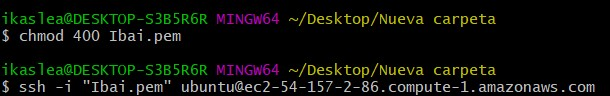

* Hacer update en el servidor, con el comando `Sudo apt-get update`
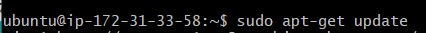

* Instalar apache2 con el comando `sudo apt install apache2 `:
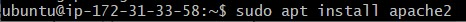

* Instalar mySql con  `sudo apt-get install mysql-server`:

* Posterior mente introduces el comando `sudo ysql_secure_installation`

* Aceptas la validacion de contraseña para tener una comporbacion y selecionar una contraseña
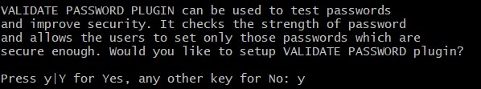

* Seleccionas el tipo de contraseña y cual seria
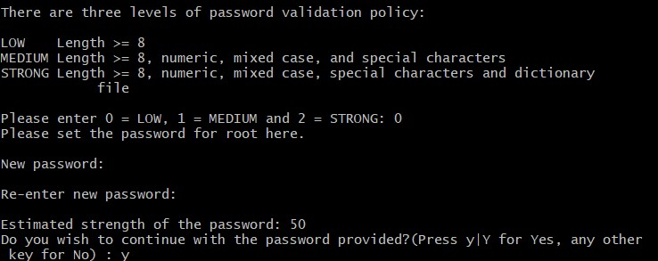

* Seleccionas si quieres borrar los usuarios anonimos y permitir el acceso remoto al mySQL: 
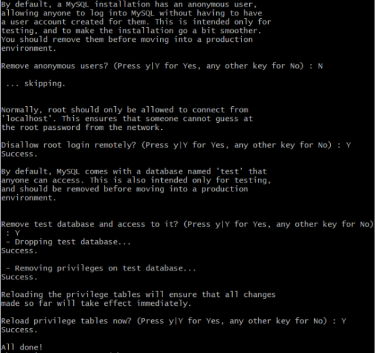

* Instalar PHP:
Con el comando `sudo apt install php libapache2-mod-php php-mysql` lo instalamos 
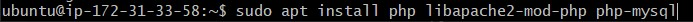

## Establecer una IP elastica
* Buscas la seccion de `Elastic IPs`
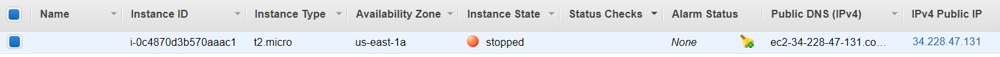

* Crear la ip elastica:
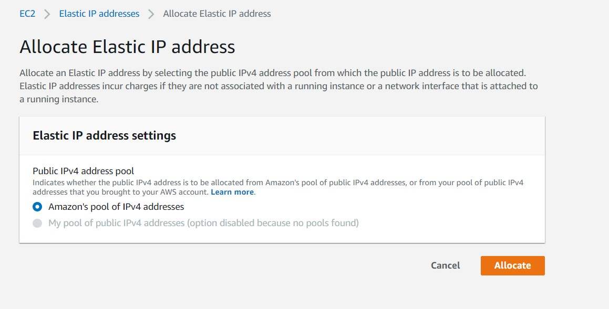

* Asociar la ip elastica creada:
Clicando en actions:
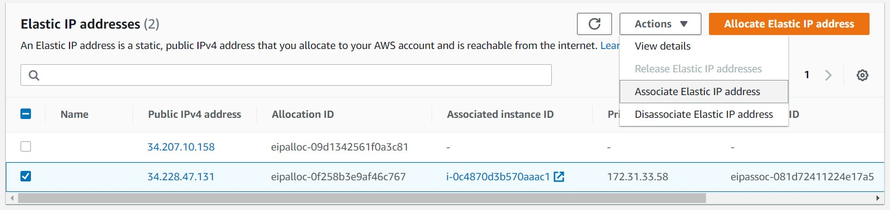

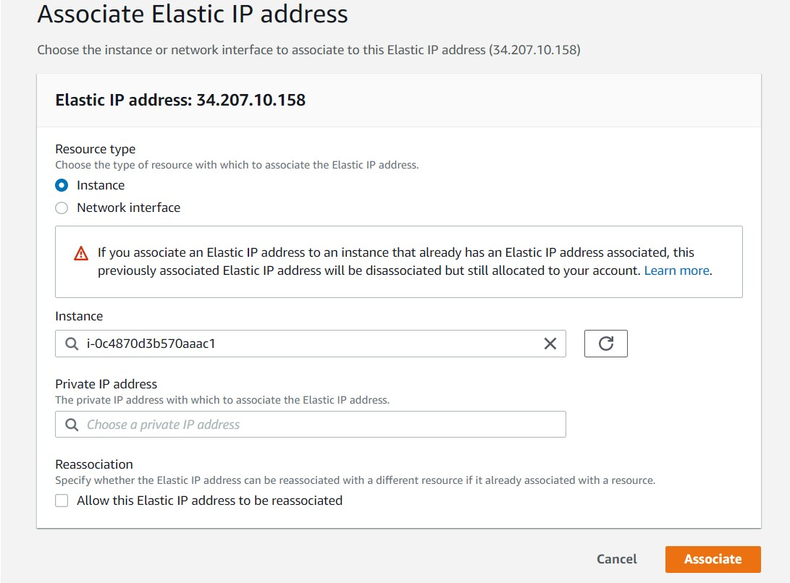

* Comprobar que funcione: 
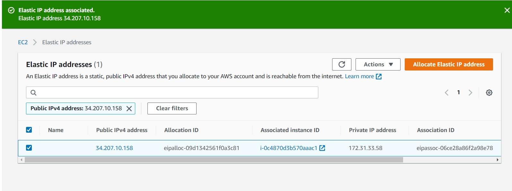

## Crear un registro de DNS

### Tipos de registros:

* A: Dirección (address). Este registro se usa para traducir nombres de servidores de alojamiento a direcciones IPv4.

* AAAA: Este registro se usa en IPv6 para traducir nombres de hosts a direcciones IPv6.

* CNAME: Se usa para crear nombres de servidores de alojamiento adicionales, o alias, para los servidores de alojamiento de un dominio. Es usado cuando se están corriendo múltiples servicios (como FTP y servidor web) en un servidor con una sola dirección IP.

* TXT: Los registros TXT son un tipo de registros de sistema de nombres de dominio (DNS) que contienen información de texto de fuentes externas a tu dominio y que puedes añadir a su configuración.

* SRV:  Service record
a