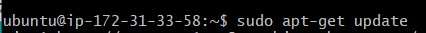
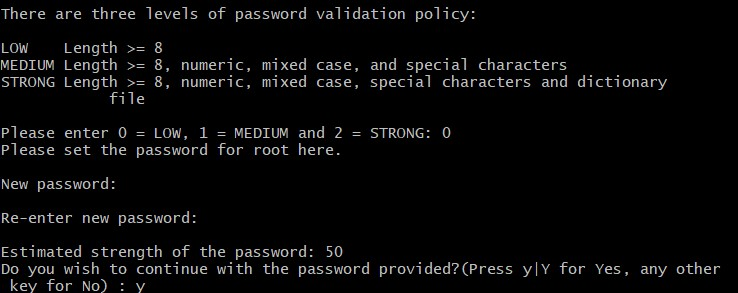
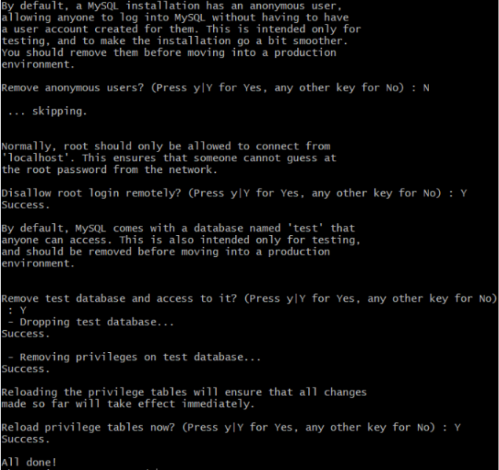

+ [Indice](../README.md)
##Instalar en amazon webservice:

* Conectarse al servidor por SSH

* Hacer update en el servidor, con el comando `Sudo apt-get update`

* Instalar apache2 con el comando `sudo apt install apache2 `:

* Instalar mySql con  `sudo apt-get install mysql-server`:

* Posterior mente introduces el comando `sudo ysql_secure_installation`

* Aceptas la validacion de contraseña para tener una comporbacion y selecionar una contraseña

* Seleccionas el tipo de contraseña y cual seria

* Seleccionas si quieres borrar los usuarios anonimos y permitir el acceso remoto al mySQL: 

* Instalar PHP:
Con el comando `sudo apt install php libapache2-mod-php php-mysql` lo instalamos 

