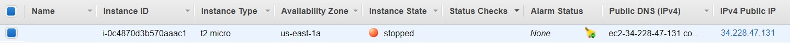
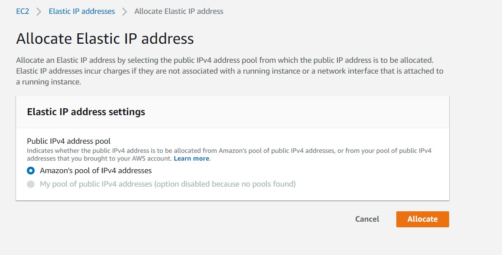
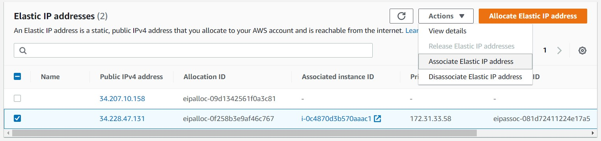
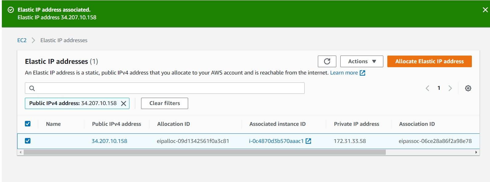

+ [Indice](../README.md)
## Establecer una IP elastica
* Buscas la seccion de `Elastic IPs`

* Crear la ip elastica:

* Asociar la ip elastica creada:
Clicando en actions:

* Comprobar que funcione: 
