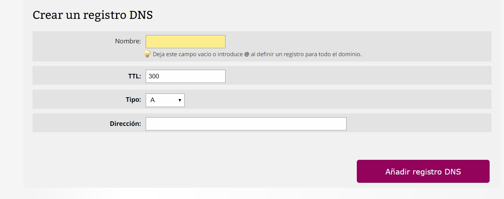
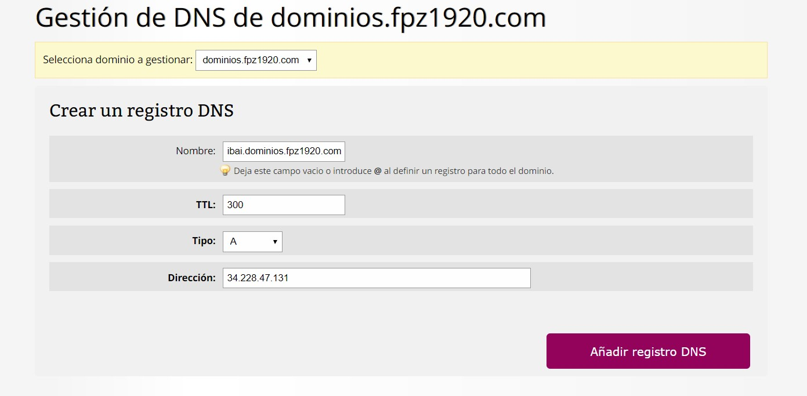

+ [Indice](../README.md)
## Crear un registro de DNS

### Tipos de registros:

* A: Dirección (address). Este registro se usa para traducir nombres de servidores de alojamiento a direcciones IPv4.

* AAAA: Este registro se usa en IPv6 para traducir nombres de hosts a direcciones IPv6.

* CNAME: Se usa para crear nombres de servidores de alojamiento adicionales, o alias, para los servidores de alojamiento de un dominio. Es usado cuando se están corriendo múltiples servicios (como FTP y servidor web) en un servidor con una sola dirección IP.

* TXT: Los registros TXT son un tipo de registros de sistema de nombres de dominio (DNS) que contienen información de texto de fuentes externas a tu dominio y que puedes añadir a su configuración.

* SRV:  Service record

### Vincular subdominio con la instacia de AWS

* Accedes al panel del subdominio y entras en registro de DNS.

* Al acceder registros encontraras un formulario

* Rellenar los datos y crear el subdominio apuntando a la IpElastica.

