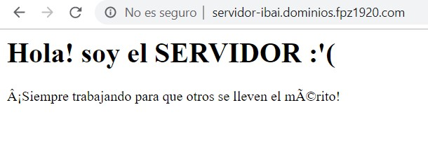

+ [Indice](../README.md)
### Virtual host

* Copia el 000-default.conf con el mnombre que desees que el comando `sudo cp /etc/apache2/sites-available/000-default.conf /etc/apache2/sites-available/servidor.conf`

* modificas el archivo que acabas de crear con la configuración deseada

* Virtual host servidor: 

* Añadirlo al apache con el comando `sudo a2ensite cliente.conf`

* Reiniciar el servidor tras modificar el virtualHost:

* Vista cliente:

* Vista servidor:
