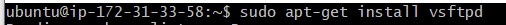
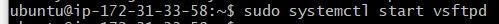
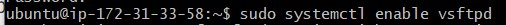
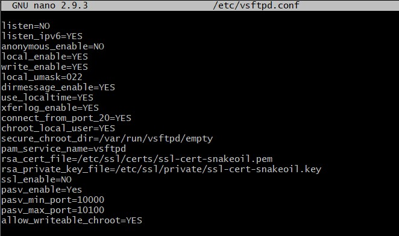
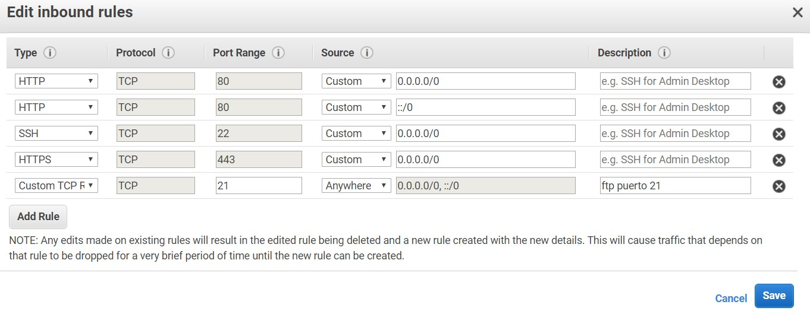
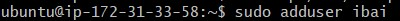
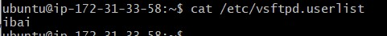
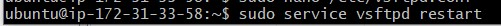

+ [Indice](../README.md)
### FTP

* Se instala con el comando `sudo apt-get install vsftpd`:

* Se inicia el servicio y lo activas:

* creas una copia del archivo de configuacion :

* Accedes al archivo original con el comando`sudo nano /etc/vsftpd.conf` y añades las siguientes filas y guardas:

* Añadir el protocolo ftp al servidor:

* Crear usuario con `sudo  useradd -g ftp -d /var/www/carpeta deseada/ -c "Tipo usuario" usuario` y compurebas que exista:

* Reinicias:
