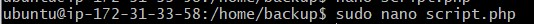
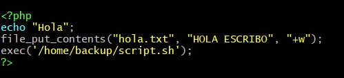
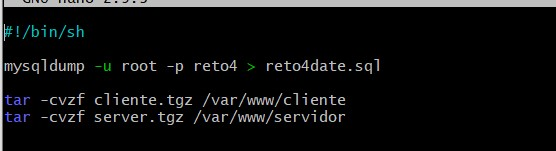
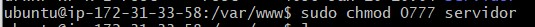
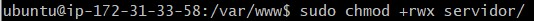
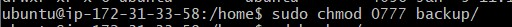
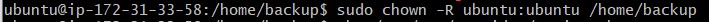
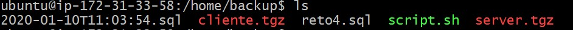
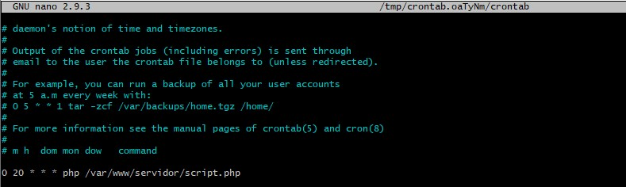

+ [Indice](../README.md)
### TAREA 7

* se crea una carpeta en la que guardas los backups:

* Creas el PHP para ejecutar apuntando al .sh:

* Crear el script .sh:

* Das permisos a la carpeta del en la que tienes el PHP:

* Dar  permisos a la carpeta en la que tienes el .sh y el cual almacenara las copias de seguridad:

* Cambiar usuarios:

* Comprobar que todo funciona:

##### Automatizar los backups

* Creamos con crontab para hacer el backup una tarea a ejecutar en nuestro caso `0 20 * * * php /var/www/servidor/script.php`

* Creamos con crontab para hacer que los archivos con mas de 7 dias sean borrado, en nuestro caso `20 * * * 6 find /home/backup/server-* -mtime +7 -exec rm {} \;`
