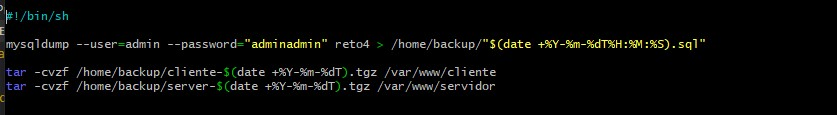
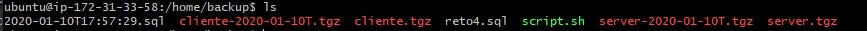

+ [Indice](../README.md)
### TAREA 7

* se crea una carpeta en la que guardas los backups:

* Creas el PHP para ejecutar apuntando al .sh:

* Crear el script .sh:

* Das permisos a la carpeta del en la que tienes el PHP:

* Dar  permisos a la carpeta en la que tienes el .sh y el cual almacenara las copias de seguridad:

* Cambiar usuarios:

* Comprobar que todo funciona:
